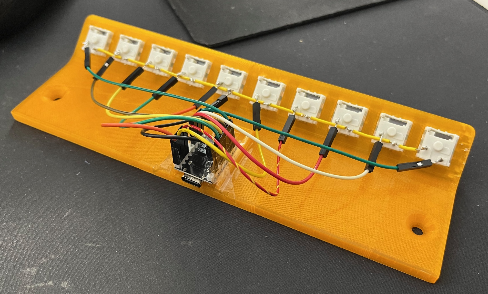

# MacroPad

This is an ESPHome configuration for a 10-key macropad using a ESP32-C3 Super Mini board. The keys are expose to Home Assistant as binary sensors. Also, the macropad acts as a Bluetooth proxy for Home Assistant to connect to Bluetooth devices, e.g. from SwitchBot or similar vendors with Bluetooth devices.

## How to use
- Clone this repository
- Copy `secrets.yaml.example` to `secrets.yaml` and fill in the values
- Edit `macropad.yaml` to match your key configuration
- Build the firmware using https://esphome.io documentation
- Flash the firmware to the ESP32-C3 Super Mini board
- (Optional) In your router, set a fixed IP address for the ESP32-C3 Super Mini board
- Add the MacroPad to Home Assistant. It should be automatically discovered
- Wire up the keys to the ESP32-C3 Super Mini board

## Build process

